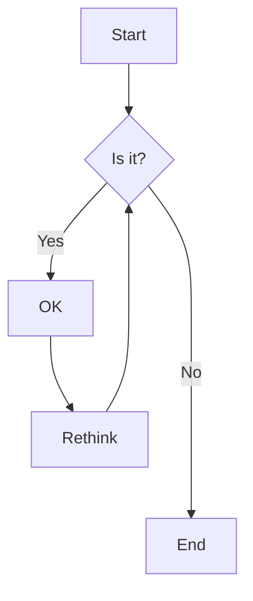
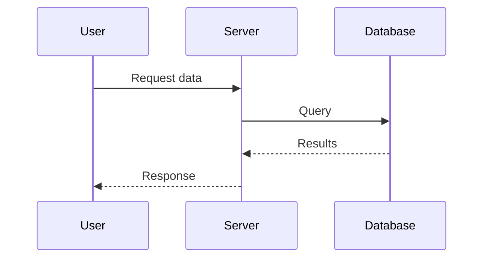

# Advanced Features

Unlock the full potential of MKDocs Material with these advanced features.

## Code Annotations

Add annotations to code blocks for detailed explanations:

```python
def process_data(data):  # (1)
    result = []
    for item in data:  # (2)
        result.append(item * 2)
    return result  # (3)
```

1. Main function that processes input data
2. Iterate through each item in the data
3. Return the processed results

## Content Tabs

Organize content in tabs for different scenarios:

=== "Python"
    ```python
    def hello():
        print("Hello from Python!")
    ```

=== "JavaScript"
    ```javascript
    function hello() {
        console.log("Hello from JavaScript!");
    }
    ```

=== "Go"
    ```go
    func hello() {
        fmt.Println("Hello from Go!")
    }
    ```

## Advanced Admonitions

### Collapsible Admonitions

Create expandable/collapsible sections:

??? note "Click to expand"
    This content is hidden by default and can be expanded by clicking.

??? warning "Important Warning"
    This is a collapsible warning that requires user interaction to view.

### Custom Titles

!!! danger "Critical Security Warning"
    Always validate user input before processing!

!!! success "Congratulations!"
    You've mastered basic concepts!

## Task Lists

Track progress with interactive checkboxes:

- [x] Complete Getting Started guide
- [x] Learn basic Markdown
- [ ] Explore advanced features
- [ ] Build first project
- [ ] Deploy to production

## Definition Lists

Create glossary-style definitions:

`API`
:   Application Programming Interface - a set of protocols and tools for building software applications

`Markdown`
:   A lightweight markup language for creating formatted text using plain text

`Static Site Generator`
:   A tool that generates a full static HTML website based on raw data and templates

## Footnotes

Add footnotes to provide additional context[^1].

You can also use inline footnotes^[This is an inline footnote].

[^1]: This is a footnote with detailed explanation that appears at the bottom of the page.

## Keyboard Keys

Document keyboard shortcuts with styled keys:

Press ++ctrl+alt+delete++ to restart your computer.

Use ++cmd+c++ to copy and ++cmd+v++ to paste on macOS.

## Math Equations

Include mathematical formulas using LaTeX syntax:

Inline equation: $E = mc^2$

Block equation:

$$
\frac{n!}{k!(n-k)!} = \binom{n}{k}
$$

## Diagrams with Mermaid

Create diagrams directly in Markdown:

### Flow Diagram



### Sequence Diagram



## Custom Icons and Emojis

Use Material Design icons and emojis:

- :material-check: Task completed
- :fontawesome-brands-github: GitHub integration
- :octicons-rocket-16: Deployment ready
- :simple-python: Python support

Emojis:

- :smile: Happy user
- :rocket: Fast performance
- :lock: Secure
- :bulb: Great idea

## Grids and Cards

Organize content in responsive grids:

<div class="grid cards" markdown>

- :material-clock-fast:{ .lg .middle } __Fast Performance__

    ---

    Static site generation ensures lightning-fast page loads

- :material-security:{ .lg .middle } __Secure by Default__

    ---

    No server-side code means no vulnerabilities to exploit

- :material-scale-balance:{ .lg .middle } __Easy to Scale__

    ---

    Serve from CDN for global reach and reliability

- :material-puzzle:{ .lg .middle } __Extensible__

    ---

    Hundreds of plugins and themes available

</div>

## Data Tables with Sorting

Advanced table features:

| Feature | Basic | Pro | Enterprise |
|---------|-------|-----|------------|
| Users | 5 | 50 | Unlimited |
| Storage | 10GB | 100GB | 1TB |
| Support | Email | Priority | 24/7 |
| Price | Free | $29/mo | $99/mo |

## Code Block Features

### Line Numbers

```python linenums="1"
def factorial(n):
    if n == 0:
        return 1
    return n * factorial(n - 1)
```

### Highlighting Lines

```python hl_lines="2 3"
def example():
    important_line = "This is highlighted"
    another_important = "Also highlighted"
    regular_line = "Normal"
```

### Title and Line Numbers

```python title="example.py" linenums="1"
class Calculator:
    def add(self, a, b):
        return a + b
```

## Next Steps

Congratulations! You've learned about advanced features. Check out the [API Reference](../api/overview.md) for technical details.

---

!!! tip "Practice Makes Perfect"
    Try implementing these features in your own documentation to master them!
