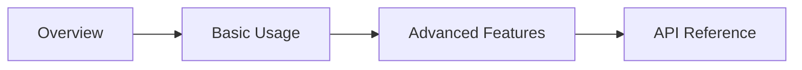

# User Guide Overview

Welcome to the comprehensive user guide! This section covers everything you need to know to use our platform effectively.

## What's Covered

This user guide is divided into several sections:

### Basic Usage
Learn the fundamental operations and everyday tasks.

### Advanced Features
Explore powerful features for experienced users.

## Guide Structure

Each section in this guide includes:

- **Concept explanations** - Understand the "why" behind features
- **Step-by-step tutorials** - Learn by doing
- **Code examples** - See features in action
- **Best practices** - Learn recommended approaches
- **Tips and tricks** - Discover shortcuts and optimizations

## How to Use This Guide

!!! info "Navigation Tips"
    - Use the left sidebar to jump between sections
    - Use the search bar to find specific topics
    - Click the "Edit" icon to see the Markdown source
    - Toggle dark mode for comfortable reading

## Quick Reference

| Topic | Description | Link |
|-------|-------------|------|
| Basic Usage | Core features and operations | [View →](basic-usage.md) |
| Advanced Features | Power user functionality | [View →](advanced-features.md) |

## Prerequisites

To get the most out of this guide, you should:

- [x] Complete the [Getting Started](../getting-started/introduction.md) section
- [x] Have a basic understanding of the platform
- [x] Be familiar with basic concepts

## Learning Path

We recommend following this learning path:

!!! tip "Take Your Time"
    Don't rush! Work through each section at your own pace.

## Getting Help

If you need assistance while working through this guide:

1. Check the relevant section thoroughly
2. Review code examples
3. Search the documentation
4. Check the [API Reference](../api/overview.md)
5. Visit our community forums

---

Ready to begin? Start with [Basic Usage](basic-usage.md)!
